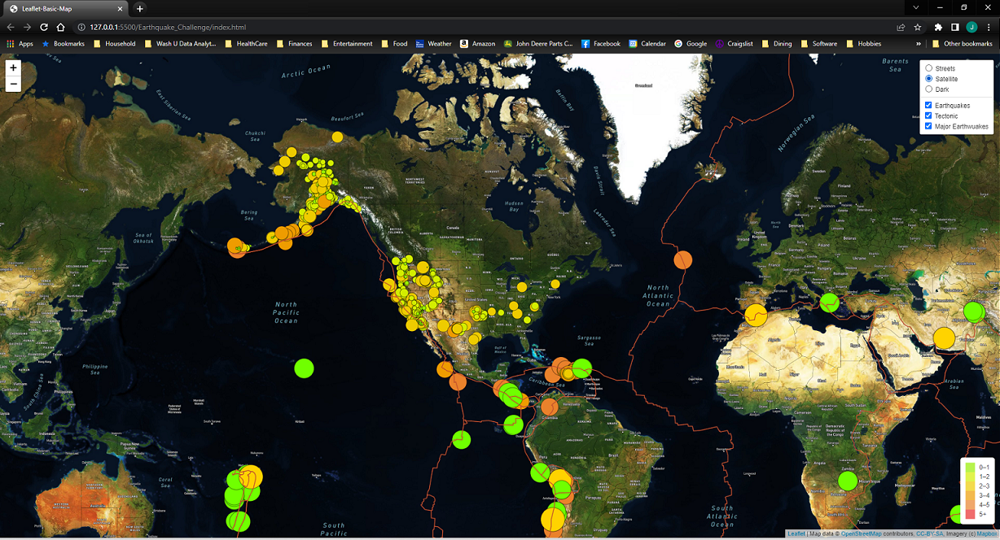

# Mapping Earthquakes

## Overview
The purpose of this module's challenge was to demonstrate proficiency with:

- Leaflet
- GeoJSON
- JavaScript
- HTML

This was achieved by developing a web page that displays:

- Earthquakes from the last 7 days scaled by magnitude
- Greater than 4.5 magnitude earthquakes scaled by magnitude with their own color scheme
- Three different base layer maps
- Tectonic plate outlines

## Results
The web site can be seen in the graphic below.

